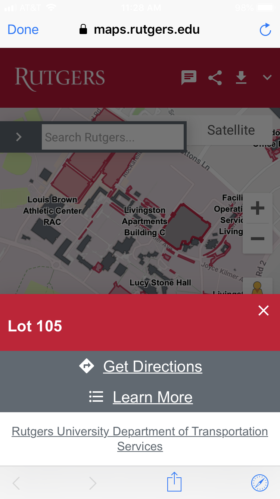

# Rutgers-Tools
A simple Rutgers app I made on Flutter.io

Flutter is similar to React Native, but much newer. It is made by Google and it can compile your code to work for iOS and Android at the same time.

Key Features:

- Rutgers Dining Hall - Has nutritional information about what you are eating, and changes the menu every day with the help of the Rutgers API.

- Rutgers Parking - Presents a user with options regarding which parking permit they have or if they are visitors and where they want to park. Finally, it outputs the parking lots that the user can park at and clicking on it would take them to a map of all parking lots on the campus if they want to find their lot.

Other Features:

- Academic Calendar
- Sakai
- Blackboard

Here are some screenshots:

  
   

  
   

  
   

  
  

